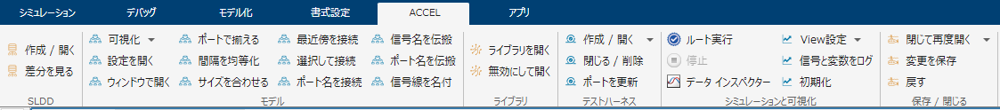

# カスタムタブを用いた Simulink のモデリング業務効率向上
# 目的


R2021b にて実装された「カスタムタブ」機能を用いて、日々の Simulink モデリング業務を効率化することができる。本コンテンツでは、その一例を示す。


カスタムタブの基本的な使い方については[こちら](https://blogs.mathworks.com/japan-community/2021/12/23/customtoolstrip/)のブログ記事を参照。


# 必要なツールボックス

   -  MATLAB® 
   -  Simulink® 
   -  Simulink Test™ 
   -  Stateflow® 

# 必要な外部ツール

   -  Git™ 

# 備考


「カスタムタブ」機能は Simulink の機能であるが、カスタムタブのボタンに関連付けたスクリプト内で、Simulink Test や Git のコマンドを利用している。すべてのコマンドで Git のコマンドを使用しているわけではない。詳細については、「カスタムタブの各ボタン紹介」セクションを参照すること。


# カスタムタブを有効化


MATLAB の現在のフォルダーを「tshintai_simulinkcustomtab」フォルダーに指定し、「enable_tshintai_CustomTab.m」を実行する。


任意の Simulink モデルを開くと、ツールストリップに新しく「ACCEL」というタブが現れる。


# カスタムタブを無効化


MATLAB の現在のフォルダーを「tshintai_simulinkcustomtab」フォルダーに指定し、「disable_tshintai_CustomTab.m」を実行する。


実行後、Simulink ツールストリップから「ACCEL」というタブが消える。


# カスタムタブの各ボタン紹介


「ACCEL」タブに配置されているオリジナルボタンの機能について紹介する。





## 1.SLDD セクション
### 1.1.「作成 / 開く」ボタン


slddファイルが関連付けられていないモデルの場合、ファイルを新規作成し、モデルに関連付ける。その後そのファイルを開く。すでに関連付けられている場合、そのファイルを開く。


詳細はカスタムタブを有効化後、以下のコマンドでスクリプトを開いて確認すること。（以降の節でも同様）


```matlab:Code
edit create_open_link_sldd_tshintaiCustomTab
```

### 1.2.「差分を見る」ボタン


モデルに関連付けられているslddファイルの現在の保存状態とローカルリポジトリの最新コミット状態を比較する。


Gitのコマンドを使用しているため、Gitがインストールされていること、slddファイルがGit管理されていることが前提となる。


```matlab:Code
edit diff_with_latest_commit_sldd_tshintaiCustomTab
```

## 2.モデル セクション
### 2.1.「可視化」リスト
### 2.1.1「次元 / データ型」ボタン


モデルの「信号の次元」と「端子のデータ型」を表示させる。


```matlab:Code
edit show_line_data_types_dimensions_tshintaiCustomTab
```

### 2.1.2.「色とタブを初期化」ボタン


モデル内のブロックの色をリセットし、タブを全て閉じる。


```matlab:Code
edit reset_model_color_and_close_tab_tshintaiCustomTab
```

### 2.2.「設定を開く」ボタン


モデルの今開いている階層のコンフィギュレーションパラメーターを開く。例えば、上位階層のモデルから参照モデルを開いている時、その参照先のモデルのコンフィギュレーションパラメーターを開く。


また、そのモデルがコンフィギュレーション参照を行っている場合は、参照先のコンフィギュレーションパラメーターを開く。


```matlab:Code
edit open_config_tshintaiCustomTab
```

### 2.3.「ウィンドウで開く」ボタン


選択したブロックを新しいウィンドウで開く。選択していない場合は、現在の階層を対象に開く。


参照モデルや参照サブシステムなどを対象とした機能であるため、普通のブロックを選択して実行した場合、ブロックパラメータが開く。


```matlab:Code
edit open_system_with_new_window_tshintaiCustomTab
```

### 2.4.「ポートで揃える」ボタン


選択したブロック同士のポート位置が横一列に揃うようにブロックの上下位置を並べ替える。また、同じ線で接続されたブロックグループを探し、そのグループごとに並べる。


合わせる位置は、同じブロックグループの終端ブロックの接続先ポート位置である。出力ポートの先にブロックが繋がっていない場合、入力ポートの先に繋がっているブロックの出力ポート位置に合わせる。


```matlab:Code
edit arrange_port_position_tshintaiCustomTab
```

### 2.5.「間隔を均等化」ボタン


選択した二つのブロックの間隔と同じになるように、他のブロック同士の間隔を自動的に調整する。調整されるブロックは、その二つのブロックと信号線で繋がれているブロックと、そのブロックに直接繋がっている他のブロックである。


また、そのブロックは1番目のInport, Outportを介して繋がっている場合に、かつ、信号線の流れが左から右に流れる向きである場合にのみ繋がっていると判定し、間隔を調整する。


また、ブロックを一つだけ選択した場合は、そのブロックがInportのみ、またはOutportのみ存在する場合に、その1番目のポートから繋がる先のブロックの間隔を調整する。


```matlab:Code
edit equalize_block_positions_tshintaiCustomTab
```

### 2.6.「サイズを合わせる」ボタン


選択状態のブロックのサイズを、フォーカスされたブロックのサイズに一致させる。


選択状態のブロックが横方向より縦方向に長く配置されている場合、ブロックの位置をフォーカスされたブロックに合わせる。


```matlab:Code
edit match_block_size_tshintaiCustomTab
```

### 2.7.「最近傍を接続」ボタン


コメントアウトされていないブロックの未接続ポートを、最も近い入力、出力ポート同士の組み合わせで接続する。


ブロックが選択されていれば、選択されているブロック群の範囲内で接続を行う。


```matlab:Code
edit connect_nearest_ports_tshintaiCustomTab
```

### 2.8.「選択して接続」ボタン


ブロックや信号線の選択状態に応じて以下のどちらかの処理を行う。


   1.  信号線が一つだけ選択されている場合、未接続の入力ポートをリスト化し、選択したポートとその信号線を接続する。 
   1.  ブロックが選択されている場合はその選択されているブロックの中で、何も選択されていなければ今のモデル階層の中で、接続可能な未接続ポートの組み合わせをリスト化し、選択したポート同士を接続する。接続後、信号名を入力し、シミュレーションデータインスペクターにログする設定を行う。 


ダイアログでキャンセルを入力した場合は、その場で処理を終了する。ポートリストは、接続可能な未接続ポートの組み合わせが存在する限り繰り返し表示される。


```matlab:Code
edit connect_rename_log_line_tshintaiCustomTab
```

### 2.9.「ポート名を接続」ボタン


現在の階層の中から未接続のInport, Outport, Subsystem, Stateflowブロック、MATLAB Function ブロックのポートを探し、同じ名前のポート名同士を接続する。


また、Inportブロックについて、同じポート名が無いが、信号名で同じものがあれば、その信号に対して接続する。


```matlab:Code
edit connect_same_port_names_tshintaiCustomTab
```

### 2.10.「信号名を伝搬」ボタン


今の階層以下のモデル内を検索し、信号線が接続されているポートに対して以下の操作を行う。


   1.  入力ポートの名前を、接続されている信号線の名前に変更する。出力ポートの名前を、接続されている信号線の名前もしくは伝搬信号の名前に変更する。信号線に名前が無い場合はポート名を変更しない。 
   1.  信号線の入力側の上位階層に信号線が接続されていれば、その信号線の名前を変更する。出力側の上位階層に信号線が接続されていれば、その信号線の名前を空にして「伝搬信号の表示」にチェックを入れる。 
   1.  サブシステムの入力ポートに名前付きの信号線が接続されている場合、そのポートの下位層のポート名を変更し、信号線の名前を空にして「伝搬信号の表示」にチェックを入れる。 
   1.  サブシステムの入力ポートに名前付きの信号線が接続されている場合、そのポートの下位層のポート名を変更し、元々の信号線の名前を空にして「伝搬信号の表示」にチェックを入れる。 


```matlab:Code
edit match_port_line_name_tshintaiCustomTab
```

### 2.11.「ポート名を伝搬」ボタン


信号線が選択されていない場合、今の階層のInport, Outportブロックのブロック名を接続されている信号線の信号名へコピーする。信号線が選択されている場合、その信号に対してのみ、コピーを実行する。


```matlab:Code
edit match_port_to_line_name_tshintaiCustomTab
```

### 2.12.「信号線を名付」ボタン


選択した信号線に名前を付け、シミュレーションデータインスペクターにログする設定を行う。


名前を入力しなかった場合、その信号線の名前を消し、ログ設定を解除する。


```matlab:Code
edit set_line_name_and_log_tshintaiCustomTab
```

## 3.ライブラリ セクション
### 3.1.「ライブラリを開く」ボタン


選択したライブラリリンクされたブロックの参照元を開く。


```matlab:Code
edit open_lib_model_linked_to_blocks_tshintaiCustomTab
```

### 3.2.「無効にして開く」ボタン


選択したライブラリリンクされたブロックのライブラリリンクを無効にし、そのブロックの内部を開く。


```matlab:Code
edit disable_and_open_lib_block_tshintaiCustomTab
```

## 4.テストハーネス セクション
### 4.1.1.「作成 / 開く」ボタン


選択したブロック、サブシステム、参照モデルなどに対してテストハーネスを作成して開く。


すでにテストハーネスが作成されている場合、そのハーネスを開く。複数のテストハーネスが作成されている場合、ダイアログで開くハーネスを選択する。


選択するブロックは一つだけでなければならない。何も選択されていない場合、現在のモデル階層に対してテストハーネスを作成し、開く。


開いたハーネスには信号線の次元とデータ型を表示する設定を行う。ハーネスの入力ポートは削除し、信号にそのポート名を付ける。


```matlab:Code
edit create_open_test_harness_tshintaiCustomTab
```

### 4.1.2.「入力を継承してテストハーネスを作成」ボタン


現在のモデルを実行した結果、そのサブシステムに入力される信号データをそのままテストハーネスの入力データとして用いる形で、テストハーネスを新規作成する。


```matlab:Code
edit create_test_harness_with_input_tshintaiCustomTab
```

### 4.2.「閉じる / 削除」ボタン


そのモデルがテストハーネスの場合、そのテストハーネスを閉じて削除する。テストハーネスではない場合、その階層にあるブロックに関連付けられているテストハーネスを全て削除する。


```matlab:Code
edit close_delete_test_harness_tshintaiCustomTab
```

### 4.3.「ポートを更新」ボタン


テストハーネスでテストを行う対象のサブシステムのポートの数が変化した時、「Signal spec. and routing」ブロックも合わせて修正したい。


この時、このスクリプトを実行することで「Signal spec. and routing」を更新することができる。


```matlab:Code
edit auto_connect_ports_in_test_harness_tshintaiCustomTab
```

## 5.シミュレーションと可視化 セクション
### 5.1.「ルート実行」ボタン


モデルを参照している参照構造の最上位階層のモデルを実行する。最上位階層のモデルが複数ある場合、ダイアログで選択する。上位階層のモデルが閉じられている場合は、検索されない。


```matlab:Code
edit root_run_tshintaiCustomTab
```

### 5.2.「View設定」ボタン
### 5.2.1.「Viewを保存」ボタン


今のシミュレーションデータインスペクターのViewをファイルに保存する。ファイル名にはモデル名を含める。


これにより、「Viewを読み込み」の方でモデル名に紐づいたファイルを読み込むことができる。


```matlab:Code
edit save_this_SDI_view_tshintaiCustomTab
```

### 5.2.2.「Viewを読み込み」ボタン


「Viewを保存」で保存された、モデル名に紐づいた設定ファイルを読み込む。


```matlab:Code
edit load_this_model_view_tshintaiCustomTab
```

### 5.3.「名前付信号をログ」ボタン


ブロックに接続されていて、かつ名前が付いている信号線をシミュレーションデータインスペクターにログするように設定する。また、Simscape変数のログ設定のOn, Offの切り替えも行う。


ダイアログで選択したものはログ有効化し、選択されなかったものはログ無効化する。


```matlab:Code
edit log_named_line_tshintaiCustomTab
```

### 5.4.「初期化」ボタン


シミュレーションデータインスペクターの環境設定とアーカイブを初期化する。


```matlab:Code
edit initialize_SDI_tshintaiCustomTab
```

## 6.保存 / 閉じる セクション
### 6.1.「閉じる系」ドロップダン
### 6.1.1.「閉じて再度開く」ボタン


モデルファイルを保存せずに閉じ、そのモデルファイルを再度開く。このスクリプトは、モデルを保存された状態に戻すことが目的である。


```matlab:Code
edit close_and_reopen_model_tshintaiCustomTab
```

### 6.1.2.「すべて閉じる」ボタン


開いているSimulinkモデルを全て閉じる。モデルは保存して閉じる。


```matlab:Code
edit close_all_Simulink_windows_tshintaiCustomTab
```

### 6.1.3.「PJを閉じる」ボタン


プロジェクトを開いている場合、プロジェクトを閉じる。開いていない場合、何もしない。


```matlab:Code
edit close_project_tshintaiCustomTab
```

### 6.2.「変更を保存」ボタン


このボタンをクリックしたモデルの参照先モデルと自身を確認し、変更されているものだけを保存する。


これにより、確実に変更されたモデルだけをGitで判別できるようになる。


```matlab:Code
edit save_dirty_models_tshintaiCustomTab
```

### 6.3.「戻す」ボタン


モデルファイルを閉じ、その後ローカルリポジトリの最新コミットの状態に戻す。


Gitのコマンドを使用しているため、Gitがインストールされていること、モデルファイルがGit管理されていることが前提となる。


```matlab:Code
edit revert_Simulink_model_tshintaiCustomTab
```

# プロジェクトにカスタムタブの設定を組み込む方法


[プロジェクト](https://jp.mathworks.com/help/matlab/projects.html)とは MATLAB ファイル、データ ファイル、Simulink モデルファイルなどをまとめ、管理できる機能である。カスタムタブをプロジェクトに組み込み、その中で管理し、プロジェクト起動中のみカスタムタブを有効化することができる。以下にその手順を紹介する。


以下の作業をする場合は、最初に「disable_tshintai_CustomTab.m」を実行し、カスタムタブを無効化しておくこと。


## 1. プロジェクトを新規作成、もしくは既存のプロジェクトを開く


プロジェクトの新規作成方法については、[こちら](https://jp.mathworks.com/help/matlab/matlab_prog/create-projects.html)を参照すること。開いたプロジェクトに「resources」フォルダがあることを確認する。


「resources」フォルダが存在せず、代わりに「.SimulinkProject」が存在する場合は、新規に作成することを推奨する。（「.SimulinkProject」は、R2018b以前に作成された旧式のプロジェクトである）


## 2. カスタムタブの「resources」を統合する


プロジェクトの設定ファイルが格納されている「resources」フォルダーに、カスタムタブの「resources」フォルダー以下のファイル、フォルダーをコピーする。


## 3.パスを設定する


プロジェクトのパスに[プロジェクトのルート]が入っていない場合は、それを追加する。


[プロジェクトのルート]を追加するには、上記画像の「フォルダーを追加…」ボタンをクリックし、現在開いているプロジェクトの最上位階層フォルダー（”.prj”ファイルを直下に含むフォルダー）を指定すればよい。


## 4."slReloadToolstripConfig"を起動、シャットダウン時に実行させる


「プロジェクトの起動とシャットダウンの管理」にて、「Simulink カスタマイズの更新」にチェックを入れる。


## 5.シャットダウン時に無効化する


シャットダウン時に実行するファイルに、[プロジェクトのルート]パスを削除してSimulink カスタマイズの更新をさせることで、プロジェクトのシャットダウン時にカスタムタブの設定を無効化することができる。


  
# 過去バージョン


過去のバージョンのファイル一式は、以下から得ることができる。ただし、過去のモデルには、古い時期に作成したサンプルしか含まれていないことに注意すること。


GitHubからクローンしている場合には、以下の該当バージョンに戻すことで、過去バージョンファイルを得ることができる。


  


R2022a: [v2.6.1](https://github.com/mathworks/customTab-accelerate-your-work/archive/refs/tags/v2.6.1.zip)


R2021b: [v1.2](https://github.com/mathworks/customTab-accelerate-your-work/archive/refs/tags/v1.2.zip)


  


* Copyright 2022 The MathWorks, Inc.*


